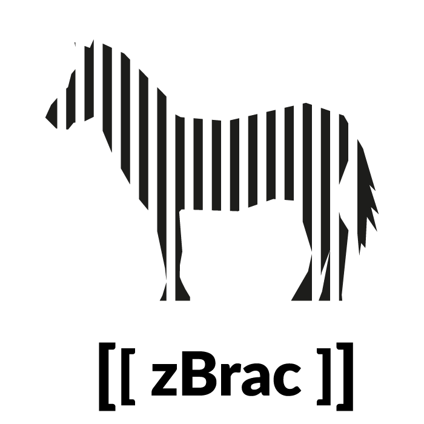

# zBrac : A multilanguage tool for zTree

Created by Ali Seyhun Saral and Anna Schroeter  
Licensed under GNU General Public License v3.0  
  
## About the project
zBrac[1] is a tool designed for easy modification of the text in z-Tree[2] treatment files. With zBrac, you can export specified text into *a language file* and import it back after the text modification or translation.

The main advantage of using zBrac for z-Tree experiment development is that that the text in zTree files can be modified easily at any time, which means the coding process and the text design/translation process can be independently done.

zBrac's design is specifically tailored for multicultural studies: By using the software, you can code your experiment once and send the original language file for translation. zBrac also tries to tackle encoding issues special characters in z-Tree by offering different encoding options.

zBrac is particularly useful when the treatment file contains the same piece of text several times. Such duplicate text is very common in z-Tree programming as it is often needed to copy-paste stage tree elements. zBrac recognizes each unique key as a single key and it would be enough to provide the text to replace for this key at once. For an example, please see below for the Holt and Laury measure example.

**zBrac is free software (See GNU GPL-3 Licence). You can edit, modify and distribute it. Moreover, it is not obligatory to cite the software, although it is highly appreciated.**

### Citation information
Currently, a paper about zBrac is submitted to a scientific journal. If you use the software and would like to cite the paper, please visit this page or contact us before you share your manuscript to check the status of the paper.

## Design
### Keys
zBrac recognizes the text that are enclosed in double brackets: `[[This is a text]]`. Each piece of text inticated as such are called "*keys*".

Each key acts as a placeholder and later can be to be replaced by another text.

To give an example, if you'd like to add a welcome message on your zTree file but you are not sure about the exact message at that point, you can just put `[[welcome message]]` in the desired place.

If you like to use zBrac on your own code and if your treatment file is already written, the text in your file should be enclosed by `[[` and `]]`. If you will write a zTree treatment from scratch, it is more efficient to write the desired text in double brackets while programming. Afterwards the brackets can easily deleted at once by using the *Strip Brackets* function of zBrac.

### Language files (xlsx)
A language file is an excel file which in each row contains a key as the first column, and a text to replace the key with in the second column. For instance, once we have our welcome message, an excel file following the structure would allow us to replace the key:  

| (column1)  | (column2) |
| ------------- | ------------- |
| [[welcome message]]| Welcome to our experiment |

Each language file is designed to be a set of text. For instance if you would like to have your experiment in different languages, ideally each one of them should have its own language file.

### Treatment files (txt)
Treatment files (TXT): Treatment files are basically zTree treatment files in TXT. They can be exported/imported using zTree. 

### Summary
To prepare your ztt treatment file to work with zBrac, you shoud
* Define the text by adding double brackets at the beginning and at the end of the text. (ie. `[[this is my text]]
* Export your file into a text file by using zTree

## Example: Translating Holt and Laury Measure[3]

Here we demonstrate how to use zBrac by using a Holt & Laury Measure of Risk Aversion from English to German.[4]

This is the english version we started with:

and the file looks like this on the client screen:
 

First we enclose all the text we want to modify with double brackets. The file now looks like this: 

Then we exported the file to a text file by clicking: 
`File` then `Export` and `Treatment`.

The exported TXT files with brackets act like our master file. We can replace the values of the keys by using a treatment file.

We can either prepare a language file with the format described above, or we can generate a language file template by using relevant function of zBrac. We will do the second.  
We choose the `Create Language File` function and save the language file.

This language file template now looks like this. In the first column it contains keys, in the second column it contains values that were generated by removing brackets from keys.:

We create a German language file by translating the second column.

Notice that the original treatment file contains 40 duplicates the text "chance of winning" and with zBrac we modifiy that text only once. 

To replace the German text with the keys, we go to `Implement 
Language File` tab and specifiy the treatment file and the language file that consists our translation.

We click `Save treatment file as...` to create a translated version of our treatment file and save it. 

Finaly we go back to zTree and choose `File`> `Import` and select our translated treatment file. This is what our result looks like:

## Installation
Current development version is v1.0.4 while the latest release is v1.0.3. For the deveopment version you can use the source files on this repository. For the relases please see below.

### Installation with Windows Installer

You can download the installer here:

[zBrac-1-0-3-win32-setup.exe](https://github.com/seyhunsaral/zbrac/releases/download/v1.0.3/zBrac-1-0-3-win32-setup.exe)

### Installation with pip (Windows, GNU/Linux, MacOS)

If you have Python(>=3.6) and pip on your computer you can install with

`pip3 install zbrac` or `pip install zbrac`

Then `zbrac` command opens the software

## Contributing

Guidelines for contributing will be available soon.

## Acknowledgements
zBrac is designed and built at the Max Planck Institute for Research on Collective Goods. We used Python 3.6 and Qt5 to build it.

We would like to thank Zvonimir Bašić, Andreas Drichoutis, Zwetelina Iliewa, Matteo Ploner, Piero Ronzani, Marco Tecilla and Fabian Winter for their valuable comments and/or for their help. 

## References and Footnotes
[1] :  The name zBrac is a portmanteau of the words zTree and brackets. 
It is pronounced ˈzibrək, like zebra (that's where the logo comes from)

[2] : Fischbacher, U. (2007). z-Tree: Zurich toolbox for ready-made economic experiments. Experimental economics, 10(2), 171-178.

[3] : Holt, C. A., & Laury, S. K. (2002). Risk aversion and incentive effects. American economic review, 92(5), 1644-1655.

[4] : We used a sample sent to the z-Tree mail group. Credits : Andreas Drichoutis
